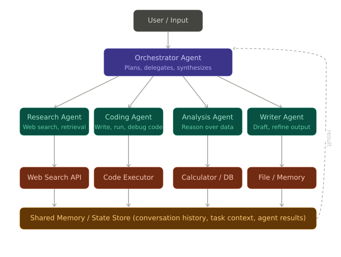
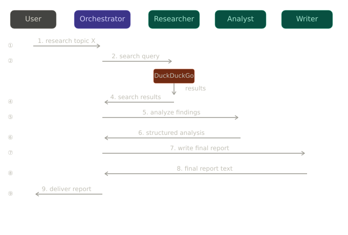

# What is a Multi-Agent System?

A single LLM is like a solo developer. A multi-agent system is a team of LLMs, each with a specialized role, coordinated by an orchestrator. The diagram above shows the full picture: user input → orchestrator → specialized agents → tools → shared memory → final result back to user.

## High level design

### The Project: AI Research Team

**Problem:** You want to research any topic and get a comprehensive, sourced report. Manually: takes hours. With a multi-agent system: automated in seconds.

**Architecture:** One orchestrator coordinates three specialized agents — a Researcher (searches the web), an Analyst (reasons over results), and a Writer (produces the final report).

### Sequence flow

### Orchestrator 

The orchestrator is the conductor of the orchestra. It takes user input, breaks it down into tasks, assigns those tasks to the appropriate agents, and manages the flow of information between them. It also handles the final output back to the user.

### Specialized Agents

Each agent has a specific role:

- **Researcher:** Uses tools like web search to gather information on the topic.
- **Analyst:** Takes the raw information from the Researcher and synthesizes it, identifying
key insights and connections.
- **Writer:** Takes the synthesized insights from the Analyst and crafts a coherent, well-structured report.

### Tools

Agents can use various tools to accomplish their tasks. For example, the Researcher might use a web search API, while the Analyst might use a knowledge graph or a database. The Writer might use a language model to help with drafting the report.

### Shared Memory

Agents can store and retrieve information from a shared memory. This allows them to build on each other's work. For example, the Researcher can store its findings in the shared memory, which the Analyst can then access to do its analysis.

## Benefits of Multi-Agent Systems

- **Specialization:** Each agent can be optimized for its specific task, leading to better performance.
- **Scalability:** You can add more agents with different specializations as needed.
- **Flexibility:** The orchestrator can dynamically assign tasks to agents based on the current needs of the project.
- **Collaboration:** Agents can work together, sharing information and building on each other's work to achieve a common goal.

## Conclusion

Multi-agent systems represent a powerful approach to leveraging the capabilities of multiple LLMs in a coordinated way. By designing specialized agents and an effective orchestrator, you can automate complex tasks and achieve results that would be difficult for a single LLM to accomplish on its own.

 --------

### Output Example 

[Orchestrator] Step 'research' → ResearchAgent: starting
[Researcher] Searching: 'Latest developments in quantum computing 2024'

[Researcher] →
* No relevant information found on "Latest developments in quantum computing 2024" as the search results are empty.
* It is recommended to try alternative search queries or check reputable sources such as:
  + IBM Quantum: https://www.ibm.com/quantum
  + Google Quantum AI Lab: https://quantum.ai/
  + NASA Quantum Computing: https://www.nasa.gov/quantum 
* For the most up-to-date information, consider checking academic journals, research papers, or industry reports on quantum computing.
* No specific facts or developments can be extracted due to the lack of search results.
──────────────────────────────────────────────────
[Orchestrator] Step 'research' → ResearchAgent: complete
[Orchestrator] Step 'analysis' → AnalystAgent: starting

[Analyst] →
**Critical Analysis: Latest Developments in Quantum Computing 2024**

### Key Insights
1. **Lack of Available Information**: The search results for "Latest developments in quantum computing 2024" are empty, indicating a lack of readily available information on this topic.
2. **Recommended Sources**: Reputable sources such as IBM Quantum, Google Quantum AI Lab, and NASA Quantum Computing are suggested as potential alternatives for finding relevant information.
3. **Need for Alternative Search Methods**: It is recommended to try alternative search queries, check academic journals, research papers, or industry reports for the most up-to-date information on quantum computing developments.

### Information Quality Assessment
The quality of the information is **Low** due to the absence of specific facts or developments related to the topic. The search results do not provide any concrete data or insights, making it challenging to assess the reliability or accuracy of the information.

### Knowledge Gaps
The primary knowledge gap is the **lack of information on the latest developments in quantum computing for 2024**. The absence of search results indicates a need for more targeted research or exploration of alternative sources to gather relevant data.

### Confidence Level
The confidence level in the analysis is **Low**. This is due to the scarcity of information and the inability to extract specific facts or developments related to the topic. The recommendations for alternative sources and search methods are based on general knowledge of reputable sources in the field, but the lack of concrete data limits the confidence in the analysis.

### Recommendations for Future Research
To improve the analysis and confidence level, it is recommended to:
- Explore alternative search queries and keywords related to quantum computing developments in 2024.
- Consult academic journals, research papers, and industry reports for the most up-to-date information.
- Visit the recommended reputable sources (IBM Quantum, Google Quantum AI Lab, NASA Quantum Computing) for potential insights and developments.
- Consider expanding the search to include related topics or broader timeframes to gather more comprehensive information.
──────────────────────────────────────────────────
[Orchestrator] Step 'analysis' → AnalystAgent: complete
[Orchestrator] Step 'writing' → WriterAgent: starting

[Writer] →
**Executive Summary**
The latest developments in quantum computing for 2024 are currently unknown due to a lack of available information. Reputable sources such as IBM Quantum, Google Quantum AI Lab, and NASA Quantum Computing may provide alternative insights, but a more targeted research approach is necessary. Further exploration of academic journals, research papers, and industry reports is recommended to gather the most up-to-date information on quantum computing developments.

**Key Findings**
* Lack of available information on the latest developments in quantum computing for 2024
* Recommended sources: IBM Quantum, Google Quantum AI Lab, and NASA Quantum Computing
* Need for alternative search methods, including academic journals, research papers, and industry reports
* Low confidence level in the analysis due to the scarcity of information

**Detailed Analysis**
The search for the latest developments in quantum computing for 2024 yielded empty results, indicating a significant knowledge gap. The lack of information makes it challenging to assess the current state of quantum computing and its potential applications. However, reputable sources in the field, such as IBM Quantum, Google Quantum AI Lab, and NASA Quantum Computing, may provide valuable insights and updates on their research and developments. To overcome the information gap, it is essential to explore alternative search queries, consult academic journals, and review industry reports. This will enable researchers to gather more comprehensive and up-to-date information on quantum computing developments.

The quality of the information available is currently low due to the absence of specific facts or developments related to the topic. The recommended sources and search methods are based on general knowledge of the field, but the lack of concrete data limits the confidence in the analysis. Therefore, it is crucial to adopt a more targeted research approach, including visiting the recommended reputable sources and expanding the search to include related topics or broader timeframes.

**Conclusion**
In conclusion, the latest developments in quantum computing for 2024 are currently unknown due to a lack of available information. To overcome this knowledge gap, it is essential to explore alternative search methods, consult reputable sources, and gather information from academic journals, research papers, and industry reports. By adopting a more targeted research approach, researchers can gather more comprehensive and up-to-date information on quantum computing developments and improve their confidence in the analysis.

**Sources**
* IBM Quantum: https://www.ibm.com/quantum
* Google Quantum AI Lab: https://quantum.ai/
* NASA Quantum Computing: https://www.nasa.gov/quantum
Note: Due to the lack of available information, no specific academic journals, research papers, or industry reports can be cited. However, these sources are recommended for future research to gather more comprehensive and up-to-date information on quantum computing developments.
──────────────────────────────────────────────────
[Orchestrator] Step 'writing' → WriterAgent: complete

 Report saved to report.md

 Task Log:
  research → ResearchAgent: starting
  research → ResearchAgent: complete
  analysis → AnalystAgent: starting
  analysis → AnalystAgent: complete
  writing → WriterAgent: starting
  writing → WriterAgent: complete
